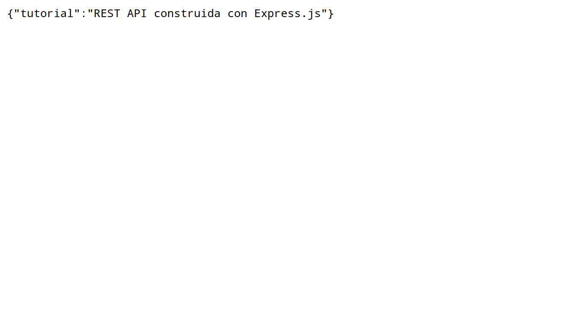

# API con Express.js + Mongoose.js

En este tutorial vamos a estar creando una API REST que nos permitira hacer un CRUD de tareas o _"todos"_. A modo de introduccion, en este tutorial evitaremos la parte de autenticacion, la cual vendra en una segunda parte. Para ver el proyecto completo mas autenticacion con JWT: [https://github.com/profran/todocrud](https://github.com/profran/todocrud)

---

## Prerequisitos

- nodejs

- npm

- mongodb (Se puede correr en Docker)

## Implementacion

Abrimos una terminal y navegamos hasta el directorio donde queremos crear el proyecto

```bash
$ mkdir node-api && cd node-api
$ npm init -y
```

Una vez inicializado el proyecto, procederemos a instalar las dependencias necesarias

```bash
$ npm install body-parser express mongoose morgan --save
$ npm install nodemon -g
```

- body-parser: Parsea las peticiones en un middleware anterior a nuestros metodos, para luego acceder al body con la propiedad `req.body`.

- express: Express es un framework minimalista y robusto para Node.js que nos da muchas herramientas para crear aplicaciones web.
  
  mongoose: Es una herramienta para modelar objectos en MongoDB

- morgan: Logger de peticiones HTTP para Node.js

- nodemon: Este estara escuchando a cambios en la estructura de archivos del proyecto y automaticamente reiniciara el servidor cuando existan cambios.

Ya instaladas las dependencias, estamos listos para empezar a crear la estructura general de archivos. En la ruta principal del proyecto usamos estos comandos

```bash
mkdir -p -- api/controllers api/models routes config
touch server.js
```

El arbol de archivos deberia verse asi

```bash
node-api/
├── node_modules/
├── api/
│   ├── controllers/
│   └── models/
├── routes/
├── config/
├── package.json
├── package-lock.json
└── server.js
```

Notemos que estamos usando el patron de diseño MVC o _Model View Controller_.

Ahora deberemos editar el archivo `server.js` el cual es el punto de entrada de nuestra aplicacion. 

_server.js_

```javascript
const express = require('express') 
const logger = require('morgan')
const bodyParser = require('body-parser')
const app = express()

app.use(logger('dev'))

app.use(bodyParser.urlencoded({ extended: false }))

app.get('/', (req, res) => {
  res.json({ tutorial: 'REST API construida con Express.js' })
})

app.listen(3000, () => {
  console.log('Servidor Node.js escuchando en el puerto 3000')
})
```

Ahora podemos correr la aplicacion con

```bash
$ nodemon server.js
```

Si abrimos [http://localhost:3000]() en el navegador



Ahora crearemos los esquema de Mongoose para los _todos_ o tareas. Primero crearemos un archivo `todo.js` el la ruta `api/models/`.

_api/models/todo.js_

```javascript
const mongoose = require('mongoose')

// Definimos el esquema
const Schema = mongoose.Schema
const TodoSchema = new Schema({
  title: {
    type: String,
    trim: true,
    required: false
  },
  desc: {
    type: String,
    trim: true,
    required: true
  }
})

module.exports = mongoose.model('Todo', TodoSchema)
```

Mediante la creacion de estos esquemas, podemos organizar la coleccion de _todos_ en nuestra base de datos MongoDB. Ademas, al crear el esquema de Mongoose, este nos permitira acceder algunos metodos basicos como el famoso _CRUD_ o _Create, Read, Update, Delete_.

Ya creado el esquema o modelado nuestra entidad _todo_, procederemos a crear un controlador para este, quien sera el encargado de proveernos de metodos basicos para el _CRUD_ que nombrabamos anteriormente. Reitero que para mantener el tutorial a manera de introduccion, el controlador admitira solamente _Create_ y _Read_, la implementacion de _Update_ y _Delete_ queda por cuenta propia. Ahora crearemos un archivo `todo.js` el la ruta `api/controllers/`.

_api/controllers/todo.js_

```javascript
const todoModel = require('../models/todo')

module.exports = {
  create: function (req, res, next) {
    todoModel.create({ ...req.body }, (err, result) => {
      if (err) {
        next(err)
      } else {
        res.json({ status: 'OK', message: `<${result.title}> creado` })
      }
    })
  },
  getAll: function (req, res, next) {
    todoModel.find({}, (err, todos) => {
      if (err) {
        next(err)
      } else {
        res.json({ status: 'OK', todos: todos })
      }
    })
  }
}

```

Bien, ya tenemos el modelo y el controlador, ahora solo nos faltaria crear las rutas para completar la parte de _todos_. Para esto crearemos un archivo `todo.js` en la ruta `routes/`.

_routes/todo.js_

```javascript
const express = require('express')
const router = express.Router()
const todoController = require('../app/controllers/todo')

router.post('/', todoController.create)
router.get('/', todoController.getAll)

module.exports = router
```

Si vemos detalladamente, en las lineas donde ponermos `router.post` y `router.get`, notemos que _post_ y _get_ son metodos HTTP, y podemos definir otros metodos como _delete, put, patch, options_, etc.

Crearemos el ultimo archivo `database.js` que se encargara de conectarse a la base de datos MongoDB en la ruta `config/`

_config/database.js_

```javascript
const mongoose = require('mongoose')

const DB_HOST = 'localhost'
const DB_PORT = '27017'

const mongoDB = `mongodb://${DB_HOST}:${DB_PORT}/todocrud`

mongoose.connect(mongoDB, { useNewUrlParser: true })
mongoose.Promise = global.Promise

module.exports = mongoose
```

Notemos que `DB_HOST` y `DB_PORT` deberan cambiar en caso de que MongoDB se encuentre en otra direccion y puerto.

Ahora la estrucutra de archivos final de nuestro proyecto deberia verse asi

```bash
node-api/
├── node_modules/
├── api/
│   ├── controllers/
│   │   └── todo.js
│   └── models/
│       └── todo.js
├── routes/
│   └── todos.js
├── config/
│   └── database.js
├── package.json
├── package-lock.json
└── server.js
```

Por ultimo editaremos el archivo `server.js` para agregar la conexion a la base de datos ademas de las rutas de `routes/todo.js` que creamos.

_server.js_

```javascript
const express = require('express')
const logger = require('morgan')
const bodyParser = require('body-parser')
const todos = require('./routes/todos')
const mongoose = require('./config/database')
const app = express()

mongoose.connection.on('error', console.error.bind(console, 'Error de conexion con MongoDB'))

app.use(logger('dev'))

app.use(bodyParser.urlencoded({ extended: false }))

app.get('/', (req, res) => {
 res.json({ tutorial: 'REST API construida con Express.js' })
})

app.use('/todos', todos)

// Express no considera los errores 404 por defecto, asi que deberemos hacernos cargo de esto
app.use((req, res, next) => {
  let err = new Error('Not Found')
  err.status = 404
  next(err)
})

// Manejador de errores
app.use((err, req, res, next) => {
  console.log(err)

  if (err.status === 404) {
    res.status(404).json({ message: 'Ruta no encontrada' })
  } else {
    res.status(500).json({ message: 'Error del servidor' }) 
  }
})

app.listen(3000, () => {
  console.log('Servidor Node.js escuchando en el puerto 3000')
})
```

Veamos que hacemos uso de `app.use(...)` muy seguido, esto no es nada mas que decirle a nuetra app de Express que agregue un middleware, el cual se encargara de algo especifico. Por ejemplo, el la linea que dice `app.use('/todos', todos)` lo que estamos haciendo es decirle a Express que cuando llegue una peticion al `/todos`, esta sea manejada por las rutas que definimos anteriormente. Lo mismo pasa en la linea que dice `app.use(logger('dev'))`, las peticiones al servidor pasaran por esta funcion de middleware y seran imprimidas en la consola. Estos middlewares son funciones encadenadas que van haciendo _o no_ modificaciones en las peticiones e iran manejando nuestro flujo de datos. Cabe destacar que no todos los middlewares seran llamados en todos los casos, pues si al llegar una peticion pasa por el middleware de _todos_ y esta es respondida antes de pasar al proximo middleware, alli es cuando se corta la cadena y el cliente ya ha obtenido una respuesta.

Ya lo unico que queda es probar nuestra API con la herramienta que mas nos guste, en este caso la probaremos con _curl_. En la terminal escribimos

```bash
$ curl -XPOST -H "Content-type: application/json" -d '{"title": "Primer todo!", "desc": "API REST con Express.js y Mongoose.js."}' 'localhost:3000/todos/'
$ curl -XGET 'localhost:3000/todos/'
```

En la segunda parte del tutorial estaremos agregando autenticacion con JWT o _jsonwebtoken_.
